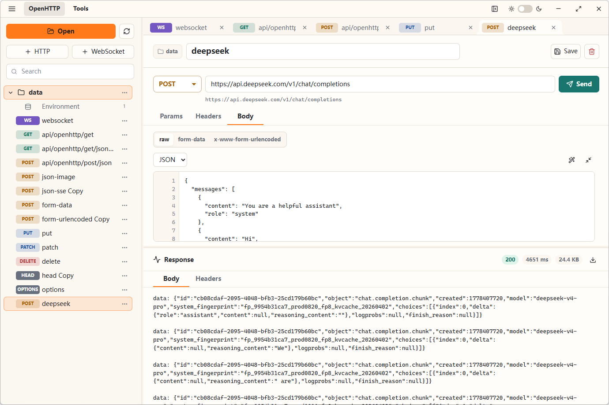
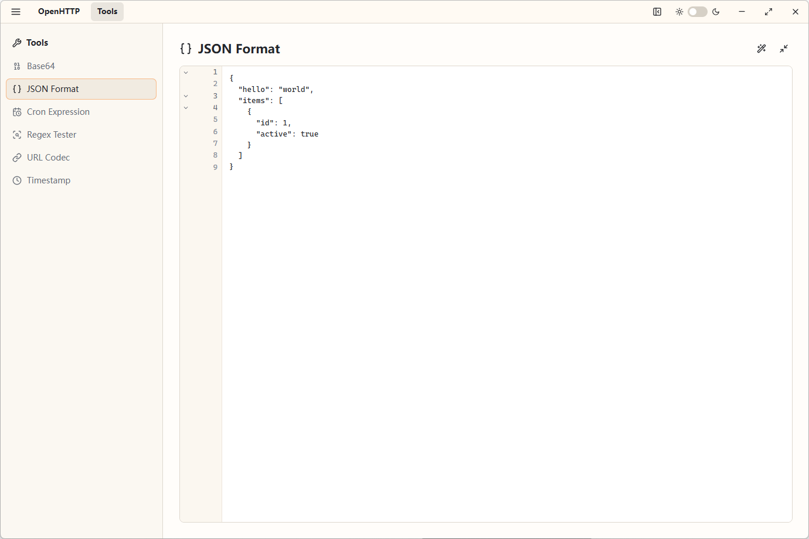

# OpenHTTP

OpenHTTP is a local-first desktop client for testing HTTP and WebSocket APIs. It is built with Electron, React, Vite, and SCSS.

## Screenshots





## Features

- Local folder based workspaces
- HTTP request editor with params, headers, and body tabs
- Raw JSON body editing with line numbers, format, and minify actions
- Form-data and x-www-form-urlencoded body editors
- Environment variables with `{{variable}}` URL substitution
- Streaming response output for LLM and SSE-style APIs
- Response preview for text, JSON, images, audio, and video
- JSON response viewer with line numbers, folding, format, and minify actions
- WebSocket connection and message testing
- Request tabs with dirty-state prompts
- Built-in tools:
  - Base64 text/file encode and decode
  - JSON format and minify
  - Cron expression builder
  - Regex tester
  - URL encode and decode
  - Timestamp converter

## Development

Install dependencies:

```powershell
npm.cmd install
```

Run the desktop app in development:

```powershell
npm.cmd run dev
```

The Vite dev server runs on `http://127.0.0.1:5173`, and Electron opens it in a desktop window.

DevTools are disabled by default to avoid Chromium resize overlays. Enable them when needed:

```powershell
$env:OPENHTTP_DEVTOOLS='1'
npm.cmd run dev
```

## Build

Build the renderer:

```powershell
npm.cmd run build
```

Create an unpacked local package:

```powershell
npm.cmd run pack
```

Build Windows artifacts:

```powershell
npm.cmd run dist:win
```

Build macOS or Linux artifacts:

```powershell
npm.cmd run dist:mac
npm.cmd run dist:linux
```

Generated packages are written to `release/`.

## Windows Packaging Notes

The Windows build is currently configured for unsigned distribution:

- `win.signAndEditExecutable` is disabled
- NSIS elevate helper packaging is disabled
- `dist:win` uses the local Electron runtime from `node_modules/electron/dist`

For public distribution, configure proper Windows code signing before release.

## Workspace Files

OpenHTTP stores requests directly in the selected workspace folder.

- Requests are stored in `.http` collection files.
- Each folder has one `.openhttp.env.json` environment file.
- A folder named `data` stores its requests in `data/data.http`.

HTTP example:

```http
### List Users
# @name list-users
# @id mabc123-456
GET {{baseUrl}}/users
Accept: application/json
```

WebSocket example:

```http
### Echo Socket
# @name echo-socket
# @id mabc124-789
WEBSOCKET {{socketUrl}}
```

## Cross-Origin Behavior

HTTP requests and WebSocket connections are executed from the Electron renderer with browser APIs. The Electron window disables normal browser CORS restrictions so OpenHTTP can be used for local API testing.

## Tech Stack

- Electron
- React
- Vite
- TypeScript
- SCSS
- lucide-react
